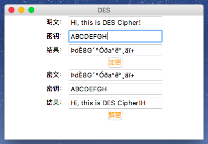
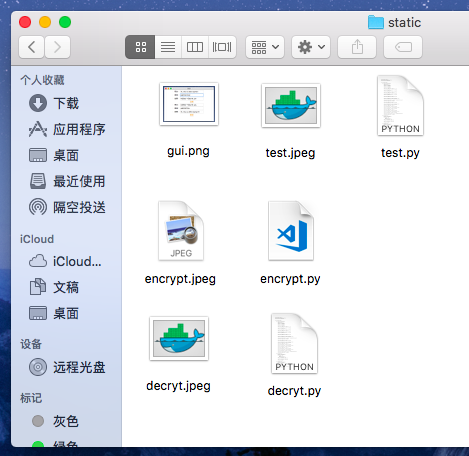

## DES 加解密的 Python 实现

### 环境

1. 使用的 Python 版本是：Python 3.6.3。
2. 无使用其他第三方库，根据密码学实验要求纯手工实现。

### 使用

**加密字符串**

在得到的项目文件夹下使用如下命令即可启动 GUI 界面：

```Python
$ python3 main.py
```

因为 DES 是分组密码，密钥要求是64位也就是8个字节的字符，所以密钥输入框只能输入8字节字符，待加密明文会对其进行填充补全，不用在意输入个数，但解密结果可能会和加密结果有所差别。



**加密文件**

在 filecipher 中定义了使用 DES 对文件进行加解密的类和方法，进入 static 文件夹后运行如下命令：

```Python
$ python3 ../filecipher.py
```



得到了加密和解密的文件。

### 拓展

可继承 mian.py 中定义的 GUI 类来做加解密文件的图形界面，这里就不写了，有兴趣的人可以尝试去拓展。